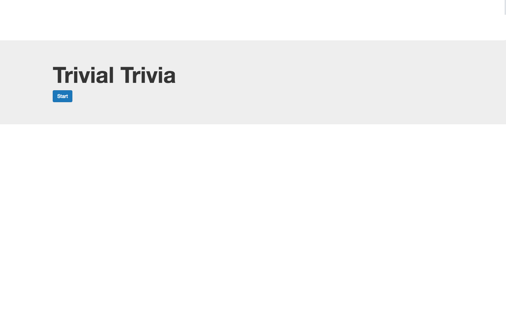
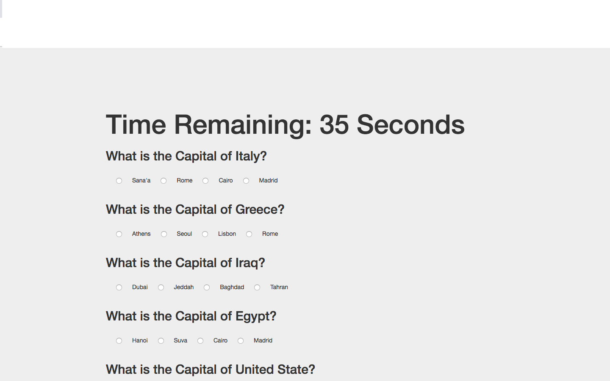

Trivia Game

Created a Trivia game using JavaScript for the logic and jQuery to manipulate HTML. 10 questions abour world capitals with countdown timer for answer. I added images for the answers.

#Start

#Answer

#Result

Copy Righr Ahmed Alharazi 2018
https://ahmedharazi.github.io/Trivial-Trivia/
